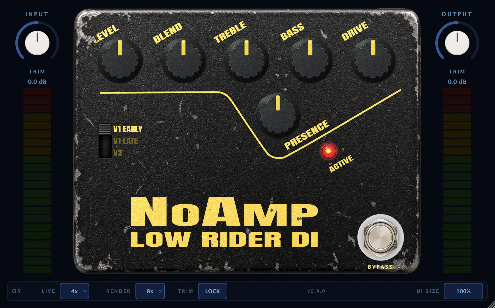

# NoAmp Low Rider DI

A circuit-accurate, revision-switchable DI/preamp plugin (AU/VST3, JUCE 8) modelled directly from
three reverse-engineered generations of the Tech 21 SansAmp Bass Driver DI (BDDI).
As far as I'm aware this is the first BDDI plugin to accurately model all three revisions, each of which have it's huge proponents. As far as I could find, it's also the only accurate BDDI plugin that still works on modern PCs outside captures (excepting the Honeycomb plugin - which is by it's own admission BDDI inspired).

That said. Have any of these pedals yourself? I'd love to make this plugin more accurate but need help to do that. If you have the pedals, and have had experience reamping before, I'd love to get some specific captures of your pedal to help improve this even more. I've used NAM profiles that are available, but they aren't as granular as I'd like to get that last 5% of accuracy like the other plugins I have done.



**[⬇ Download the latest release](https://github.com/tehguitarist/NoAmp-Low-Rider-DI/releases/latest)** 

## What it is

Rather than model one fixed circuit, this plugin lets you pick **which era of the pedal** you're
playing through, right down to the component-level differences Tech 21 made between production
runs. I wanted to capture the unique differences, as I remember early in my studio assistant days, bringing my own SansAmp BDDI into the studio and the producer saying "Oh, you got one of the good ones! They're much better than the newer ones." He was referring to my v1 Early as opposed to the V1 Late, and it's always stuck with me.

- **Three selectable circuit revisions** — V1 Early, V1 Late, and V2 — as one automatable
  `revision` parameter with a matching per-revision pedal face, not three separate plugins
- PRESENCE, DRIVE, BLEND (dry/wet mix), LEVEL, BASS, and TREBLE on every revision; V2 adds a
  post-blend MID control with a switchable centre frequency (MID SHIFT) and a BASS SHIFT
  low-frequency switch
- **The revisions are genuinely different circuits, not value tweaks**: V1 Early clips purely via
  op-amp rail saturation (no clipping diodes at all in the drive stage); V1 Late and V2 both add a
  small reverse-breakdown zener clipping sub-module in the drive feedback path; the tone stack
  changes from Baxandall shelving (V1 Early) to peaking (V1 Late/V2)
- Input/output trim with VU metering, switchable oversampling with separate Live and Render
  settings, and a glitch-free revision-switch crossfade

## Under the Hood

The entire signal path uses Wave Digital Filters in double precision, built from the circuit's
actual node-level topology rather than hand-tuned approximations:

- Passive bridge/twin-T networks solved as R-type adaptors with a **numerically-derived**
  scattering matrix (no hand-transcribed matrices)
- Op-amp-embedded linear stages (active Sallen-Key recovery filters, inverting tone/gain stages)
  solved with a bilinear-companion MNA engine treating ideal op-amps as nullors
- A bespoke reverse-breakdown zener-pair WDF element for the V1 Late/V2 drive clip — antiparallel
  diode-pair math reparameterised from the zener's physical knee, since off-the-shelf diode models
  only cover forward Shockley conduction
- Op-amp rail saturation on the V1 Early drive stage, both with 1st-order ADAA anti-aliasing
- Switchable oversampling (1×/2×/4×/8×) with a separate, higher-quality offline-render factor

## Performance (updated 2026-07-23)

Measured via `PerfBenchmark`/`FeatureProfile`/`OSFidelity` (`ctest`), Apple Silicon, Release build.
Absolute CPU % is machine-dependent — read this as relative shape, not an absolute spec. These are
fresh numbers, re-run against the current `main` — CPU cost has grown since the original Phase 9
measurement as Phase 10 added several always-on wet-path calibration layers (per-sample envelope
followers/EQ stages: `WetLFCorrection`, `WetHFCorrection`, `HFEvenRestore`, `WetTopOctaveRestore`,
`ClipDriveNormaliser`, `ClipHarmonicReducer`, `RevisionLevelTrim`, …), heaviest on V1 Late/V2 which
carry the most of them.

| Revision | OS factor | CPU % of realtime | Latency (samples) |
|----------|-----------|-------------------|-------------------|
| V1 Early | 1x        | 1.7%              | 0                 |
| V1 Early | 2x        | 1.9%              | 49                |
| V1 Early | 4x        | 2.8%              | 61                |
| V1 Early | 8x        | 4.4%              | 65                |
| V1 Late  | 1x        | 1.8%              | 0                 |
| V1 Late  | 2x        | 3.2%              | 49                |
| V1 Late  | 4x        | 5.4%              | 61                |
| V1 Late  | 8x        | 10.0%             | 65                |
| V2       | 1x        | 1.8%              | 0                 |
| V2       | 2x        | 2.9%              | 49                |
| V2       | 4x        | 4.6%              | 61                |
| V2       | 8x        | 8.0%              | 65                |

With **Eco** (HQ off — see below), V1 Late drops to 1.7/2.9/4.8/8.5% and V2 to 1.6/2.5/3.9/6.7%
across the same factors; V1 Early is unaffected (no zener, HQ is inert there).

All three revisions oversample their DRIVE nonlinearity. V1 Late / V2 cost more per factor than
V1 Early — their zener clip is a per-sample Newton/omega solve, heavier than V1 Early's hard rail
clamp, and they run more of the wet-path calibration layers above. `OSFidelity` Part C confirms the
oversampling cuts zener aliasing by ~43 dB from 1× to 8×. Latency is unchanged from Phase 9 — none
of the added layers sit inside the oversampled region or add their own delay.

**HQ/Eco toggle (added 2026-07-23, v1.0.1).** The original `FeatureProfile` read ("omega4 is
accuracy-equivalent, no toggle needed") was measured only up to the zener knee; re-measuring into
the hard-clip regime showed chowdsp's `omega4` deviating ~−42 dB (~0.75% RMS) from the accurate
solve while cutting the clipper's CPU ~2×. So the `HQ` button (in the OS strip, default **on**)
now selects:

- **HQ on (default)**: `AccurateOmega`, now deliberately 2 Halley steps — the third step cost ~27%
  of the clipper for a −123 dB waveform change (indistinguishable), so 2-Halley is the new default
  and is itself slightly cheaper than the previous release (see table above).
- **HQ off (Eco)**: swaps the zener omega solve to `omega4` — lighter CPU (Eco rows above), subtly
  coarser only at high drive. Inert on V1 Early (its rail clip has no omega solve).
- **Rail-clip ADAA** (V1 Early): ~7.6 dB less 1x aliasing for ~zero cost — a free win, always-on,
  not part of the toggle.

A `FeatureProfile` guard asserts HQ-off renders bit-identical to a compile-time omega4 chain, so
the button can never silently become a no-op.

**Low-OS top-octave restore.** The recovery cab-sim filters live inside the oversampled drive region,
so at low oversampling their bilinear discretisation droops the top octave (a pure discretisation
artifact, not a clip-fidelity issue). A base-rate high-shelf (`TopOctaveShelf`), its gain scaled per OS
factor and transparent at 4×/8×, restores it — bringing 1× to within ~±2 dB through 10 kHz. It only
engages when you drop below the 4× default, so the shipping sound is unaffected. Validated by
`OSFidelity` Part A across all three revisions.

## Accuracy — null depth vs the real pedal (updated 2026-07-23)

Measured via `analysis/knob_tolerant_null.py` against the 11 original real-pedal captures (the
second-unit `V2-2` set — a different physical pedal — is corroborating-evidence-only and is never
pooled into these numbers; see `analysis/README.md`). A capture's knob settings are hand-read off a
clock-face label, and that reading is sometimes a couple of percent off the pedal's true position —
not a model defect. So rather than nulling each capture only at its labelled setting, this sweeps
BLEND and DRIVE ±0.05 around the label (OS=8×, full-length clean sweep) and reports the deepest null
found — separating genuine model/circuit error from knob-reading slop. It also reports a
**linear-removed floor**: the null depth you'd get if every remaining linear (EQ-shape/phase)
mismatch were perfectly corrected, isolating the genuinely nonlinear (clipping-timbre) residual.

| Revision | Best null (knob-tolerant) | Linear-removed floor |
|----------|---------------------------|-----------------------|
| V1 Early | −18.0 dB                  | −41.5 dB              |
| V1 Late  | −10.8 dB                  | −22.0 dB              |
| V2       | −16.8 dB                  | −33.3 dB              |

The linear-removed floor is **10–20 dB deeper than the best achievable null on every revision** —
meaning most of the remaining gap to the real pedal is a linear EQ-shape/phase mismatch (taper,
discretisation warp, wet/dry balance), not a fundamental limit of the clipping model. V1 Late is the
shallowest of the three on both metrics, consistent with its known open items (the V1L midband
compression deficit and 4–6 kHz null misplacement — see `CLAUDE.md`'s gap table); V1 Early nulls
deepest, as expected for the revision with no clipping module at all.

## Building

Requirements: CMake 3.15+, a C++17 compiler, and the `libs/JUCE`, `libs/chowdsp_wdf`, and
`libs/xsimd` submodules (`git submodule update --init --recursive`). Supports AU + VST3 on macOS;
VST3 on Windows and Linux.

```bash
cmake -B build -DCMAKE_BUILD_TYPE=Release
cmake --build build --target NoAmpLowRiderDI_AU     # macOS AU (auto-installs; bump VERSION to force a Logic rescan)
cmake --build build                                 # everything, including the test suite
ctest --test-dir build                              # run the validation suite
```

## Where to Find Things

```text
src/PluginProcessor.{h,cpp}   APVTS, per-channel DSP, oversampling, bypass/metering
src/PluginEditor.{h,cpp}      per-revision pedal-face layout
src/dsp/                      one header per stage (WDF nodal circuits, zener clip, rail clip,
                               tone stacks) + a top-level graph per revision
src/ui/                       PedalLookAndFeel, VUMeter, ThreePositionSwitch, LEDIndicator,
                               PedalAssets (bitmap knob/switch/LED/faceplate assets)
src/utils/                    taper helpers, prewarp, change-gated smoothing
tests/                        per-stage validation exes (frequency response, THD, null, aliasing,
                               performance/fidelity probes) — registered with `ctest`
analysis/                     gen_test_signal.py + analyze.py, the real-pedal capture/A-B harness
schematics/                   the source schematic images + transcribed FR-target reference data
docs/                         calibration, FR targets, capture protocol, UI asset map
.claude/rules/                circuit reference, node-level netlists, DSP/architecture/UI/build rules
```

## Installing a Release Build

Platform installers (`.pkg` on macOS with an AU/VST3 choice screen, `.exe` via NSIS on Windows,
`.deb` on Linux) are built from `installer/{macos,windows,linux}` by the `release.yml` GitHub
Actions workflow (manual `workflow_dispatch` trigger only). Alternatively, build from source per
above and copy the resulting AU/VST3 bundle into your system's plugin folder.

## Known Limitations

- AU is macOS-only (no AU on Windows/Linux, matching the format itself)
- Reference validation against real-pedal captures (frequency response, THD-by-band, null depth)
  is not yet complete — see `docs/validation-and-capture.md`

## Acknowledgements

The three circuit revisions modelled here were reverse-engineered and published by
**[kanengomibako](https://kanengomibako.github.io/)** (可燃ごみ箱) — this project would not exist
without that independent reverse-engineering work. Component values and topology were transcribed
from their public write-ups; the schematic images themselves are not redistributed here (see
`.claude/rules/circuit.md` for the license note on the source material).

## Technical Details

Built using the [JUCE](https://juce.com/) framework, [chowdsp_wdf](https://github.com/Chowdhury-DSP/chowdsp_wdf)
for Wave Digital Filter modelling, and [xsimd](https://github.com/xtensor-stack/xsimd) for SIMD
acceleration. Licensed under [AGPLv3](LICENSE).

**Author:** Leigh Pierce
